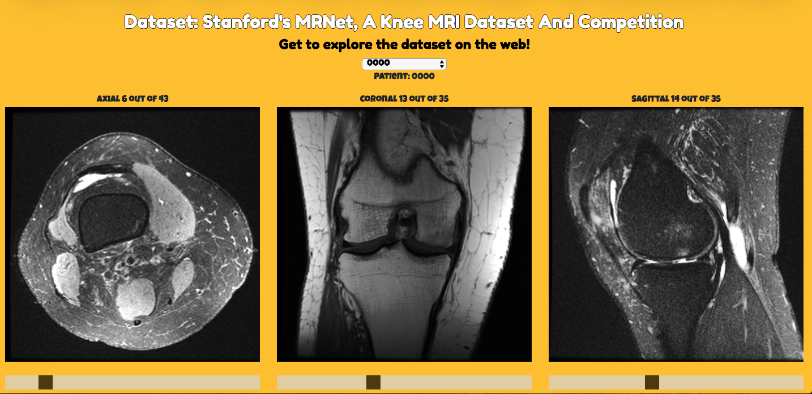
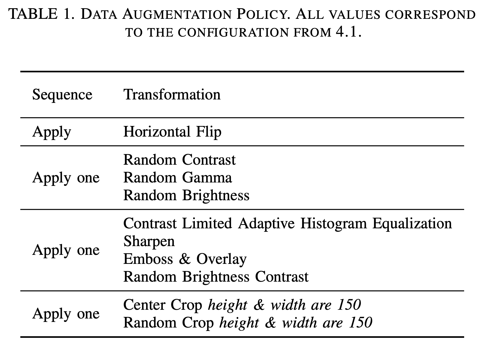
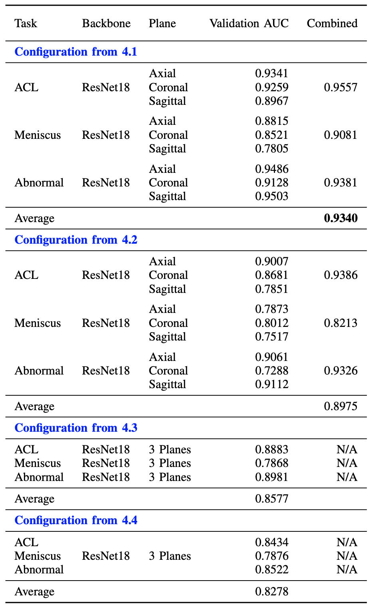
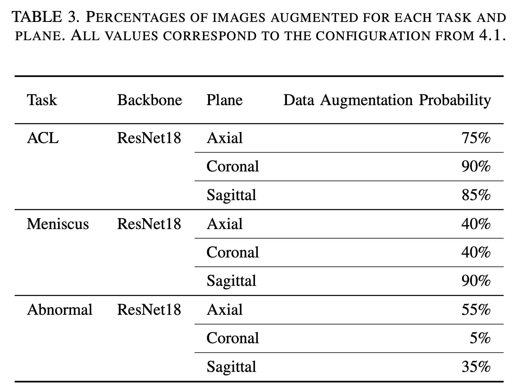
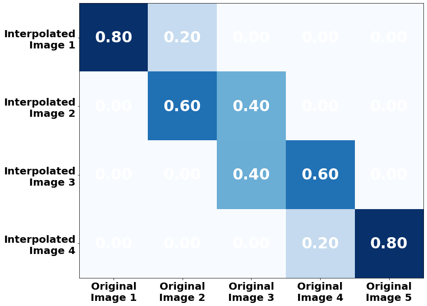

# A Comparative Study of Existing and New Deep Learning Methods for Detecting Knee Injuries using the MRNet Dataset

Paper presented at The Third International Workshop on Deep and Transfer Learning ([DTL2020](http://intelligenttech.org/DTL2020/)) as part of International Conference on Intelligent Data Science Technologies and Applications (IDSTA2020).

Please consider citing the following paper if you use any of the work:
```
@article{azcona2020comparative,
  title={A Comparative Study of Existing and New Deep Learning Methods for Detecting Knee Injuries using the MRNet Dataset},
  author={Azcona, David and McGuinness, Kevin and Smeaton, Alan F},
  journal={arXiv preprint arXiv:2010.01947},
  year={2020}
}
```



## Abstract

This work presents a comparative study of existing and new techniques to detect knee injuries by leveraging Stanford's MRNet Dataset. All approaches are based on deep learning and we explore the comparative performances of transfer learning and a deep residual network trained from scratch. We also exploit some characteristics of Magnetic Resonance Imaging (MRI) data by, for example, using a fixed number of slices or 2D images from each of the axial, coronal and sagittal planes as well as combining the three planes into one multi-plane network. Overall we achieved a performance of 93.4% AUC on the validation data by using the more recent deep learning architectures and data augmentation strategies. More flexible architectures are also proposed that might help with the development and training of models that process MRIs. We found that transfer learning and a carefully tuned data augmentation strategy were the crucial factors in determining best performance.

## Dataset

The MRNet dataset consists of knee MRI exams performed at Stanford University Medical Center. Further details can be found at https://stanfordmlgroup.github.io/competitions/mrnet/

* 1,370 knee MRI exams performed at Stanford University Medical Center
* 1,104 (80.6%) abnormal exams, with 319 (23.3%) ACL tears and 508 (37.1%) meniscal tears
* Labels were obtained through manual extraction from clinical reports

## Docker Environment 

**Prerequisites:**

* Docker needs to be installed in your system, see [here](https://docs.docker.com/get-docker/) for getting Docker

Run the following command to build and run the Docker container, and then SSH to it:
```
$ cd docker
$ docker-compose -f docker-compose.yml up -d --build
$ docker exec -it mrnet_container bash
```

In the same manner, for usability, we could use the commands on the `Makefile`:
```
$ make run
$ make dev
```

## Exploration

1. Start a Jupyter notebook:
```
$ docker exec -it mrnet_container bash
$ jupyter notebook --allow-root --ip=0.0.0.0
```

2. Convert the Numpy arrays to images as shown in [this notebook](src/notebooks/Convert%20Numpy%20Arrays%20to%20Images.ipynb)

3. start a Python server to visualize the MRIs:
```
$ python -m SimpleHTTPServer 8000
```
and then navigate to ```http://localhost:8000/``` to interact with it!

## Deployment

In our paper we propose and evaluate the performance of the following architectures to train networks and output the probabilities for a patient to have an ACL tear, meniscal tear, or some abnormality on their knee:

1. Training a Deep Residual Network with Transfer Learning
2. Training a Deep Residual Network from Scratch & Use a Fixed Number of Slices
3. Training a Multi-Plane Deep Residual Network
4. Training a Multi-Plane Multi-Objective Deep Residual Network

### 1. Training a Deep Residual Network with Transfer Learning

1. Select the approach by editing [config.py](src/config.py):
```
APPROACH = 'pretrained'
```

`pretrained` uses ImageNet pre-trained weights.

2. Train a model for each task and for each plane:
```
$ python src/train_baseline.py -t '<task>' -p '<plane>'
```

For the `pretrained` approach we use `train_baseline.py`.

For instance, for task ```acl```:
```
$ python src/train_baseline.py -t 'acl' -p 'axial'
$ python src/train_baseline.py -t 'acl' -p 'coronal'
$ python src/train_baseline.py -t 'acl' -p 'sagittal'
```
and then repeat for tasks ```meniscus``` and ```abnormal```. 

3. For each task, combine predictions per plane by training a Logistic Regression model:
```
$ python src/combine.py -t '<task>'
```

For instance, for task ```acl```:
```
$ python src/combine.py -t 'acl'
```
and then repeat for tasks ```meniscus``` and ```abnormal```.

The models with the greatest validation AUC are picked per plane

4. Generate predictions for each patient in the sample test set for all tasks: ```acl```, ```meniscus``` and ```abnormal```:
```
$ python src/predict.py
```

### 2. Training a Deep Residual Network from Scratch & Use a Fixed Number of Slices

1. Select the approach by editing [config.py](src/config.py):
```
APPROACH = 'slices'
```

`slices` uses a fixed number of slices to train a network from scratch with random initialization of the weights

2. Train a model for each task and for each plane:
```
$ python src/train_slices.py -t '<task>' -p '<plane>'
```

3. For each task, combine predictions per plane by training a Logistic Regression model:
```
$ python src/combine.py -t '<task>'
```

4. Generate predictions for each patient in the sample test set for all tasks:
```
$ python src/predict.py
```

### 3. Training a Multi-Plane Deep Residual Network

1. Select the approach by editing [config.py](src/config.py):
```
APPROACH = 'slices'
```

2. Train a model for each task but all the planes together:
```
$ python src/train_slices_planes.py -t '<task>'
```

4. Generate predictions for each patient in the sample test set for all tasks:
```
$ python src/predict_planes.py
```

### 4. Training a Multi-Plane Multi-Objective Deep Residual Network

1. Select the approach by editing [config.py](src/config.py):
```
APPROACH = 'slices'
```

2. Train a model for all task and all planes together:
```
$ python src/train_slices_planes_tasks.py -t '<task>'
```

4. Generate predictions for each patient in the sample test set for all tasks:
```
$ python src/predict_planes.py
```

## Submission

Submit to CodaLab by zipping the src folder and upload it to my worksheet:
```
$ sh codalab.sh
```

## Figures & Tables

**Data Augmentation Policy. All values correspond to the configuration from 1.**



**Results for the proposed architectures. Combined is the accuracy of a logistic regression based ensemble.**



**Percentages of images augmented for each task and plane. All values correspond to the configuration from 1.**



**Interpolation Examples: Transforming N images into M images. Matrices show the weights to be applied to each original image to interpolate to the newly transformed images**



## Further work

The following notebooks show how to **augment the MR images** by using: 

* [Pytorch transformations](src/notebooks/Augmentation%20I.ipynb), 
* [imgaug](src/notebooks/Augmentation%20II.ipynb), 
* [albumentations](src/notebooks/Augmentation%20III.ipynb#) and 
* [augmentor](src/notebooks/Augmentation%20IV.ipynb)

## Resources

### Codalab Submission

* Tutorial: https://worksheets.codalab.org/worksheets/0xcaf785cb84564239b240400fbea93ec5/
* Codalab worksheet: https://worksheets.codalab.org/worksheets/0x7f4aa230386c42698fe6079cf4365050
* Codalab tutorial: https://github.com/codalab/worksheets-examples/blob/master/00-quickstart/README.md
* https://github.com/codalab/codalab-worksheets-old/wiki/CLI-Basics

### Previous Submissions

* https://github.com/neergaard/MRNet
* https://github.com/yashbhalgat/MRNet-Competition

### Tutorials

* https://www.ahmedbesbes.com/blog/acl-tear-detection-part-1
* https://www.ahmedbesbes.com/blog/acl-tear-detection-part-2
* https://misaogura.github.io/MRNet/notebooks/MRNet_exploratory_data_analysis.html
* https://towardsdatascience.com/mrnet-competition-part-1-65fcfb1cfa5f

### Discussions

* https://forums.fast.ai/t/mrnet-stanford-knee-mri-dataset-and-competition/43685

### Visualization

* https://ilovesymposia.com/2019/10/24/introducing-napari-a-fast-n-dimensional-image-viewer-in-python/
* https://docs.opencv.org/master/d0/d84/tutorial_js_usage.html
* https://github.com/nicolaspanel/numjs
* https://github.com/MisaOgura/flashtorch

### Context

* https://radiopaedia.org/cases/isolated-acl-injury

### Models

* Models: https://github.com/pytorch/vision/tree/master/torchvision/models
* ResNet: https://github.com/pytorch/vision/blob/master/torchvision/models/resnet.py
* https://github.com/yunjey/pytorch-tutorial/blob/master/tutorials/02-intermediate/deep_residual_network/main.py
* http://www.pabloruizruiz10.com/resources/CNNs/ResNet-PyTorch.html
* https://github.com/MisaOgura/MRNet

### Pre-trained models

* https://pytorch.org/docs/stable/torchvision/models.html

### Data Augmentation

* https://towardsdatascience.com/data-augmentation-for-deep-learning-4fe21d1a4eb9
* https://github.com/Lexie88rus/augmentation-packages-overview/blob/master/data-augmentation-packages-overview.ipynb
* https://pytorch.org/docs/stable/torchvision/transforms.html
* https://colab.research.google.com/drive/109vu3F1LTzD1gdVV6cho9fKGx7lzbFll
* https://github.com/aleju/imgaug
* https://github.com/mdbloice/Augmentor

### Class Activation Maps

* https://github.com/tensorflow/tfjs-examples/tree/master/visualize-convnet
* https://towardsdatascience.com/live-visualisations-of-cnns-activation-maps-using-tensorflow-js-27353cfffb43
* https://github.com/immortal3/OnlineActivationMap
